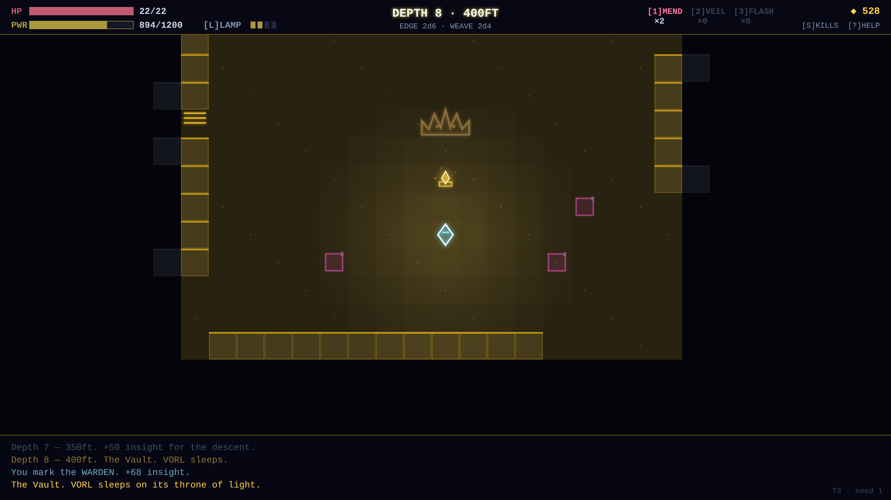

# SILQ

Fifth game in the harsh-critic-loop series, after
[NEONOID](https://github.com/melvincarvalho/neonoid),
[NEON MINER](https://github.com/melvincarvalho/neonminer),
[NEODROID](https://github.com/melvincarvalho/neodroid) and
[NEON DASH](https://github.com/melvincarvalho/neondash). A tribute to
[Sil-Q](https://github.com/sil-quirk/sil-q): a turn-based heist roguelike.
Descend eight floors of a dead neon arcology, pry the **Prime Shard** from the
crown of the sleeping machine-god **VORL**, and climb back out while the tower
wakes up and hunts you. Original theme and names — the Silmarillion belongs to
Tolkien and Sil-Q to its authors; both are revered here, neither is copied.

**Play it: <https://melvincarvalho.github.io/silq/>**



**There are no assets.** Every tile, creature and sound is generated from
code. Two files: `index.html`, `game.js`. Arrows/WASD to move, bump to fight,
`L` cycles the lamp, `1–3` quaff vials, `S` spends insight, Enter uses
stairs — and grabs the Shard.

```bash
python3 -m http.server 8000   # or just open index.html
```

## The game

The Sil spine, distilled: opposed-roll combat (1d10 + Melee vs 1d10 +
Evasion, an extra damage die for every 5 points of net hit, +5 and +2 dice
for attacking the unaware), damage dice minus armor protection dice, every
roll printed to the log. Stealth is a first-class answer: monsters sleep,
stir at noise, and hunt on sight; your lamp is both your eyes and your
signature — bright sees far and is seen far. Insight (XP) flows from first
sightings and descent as much as from kills, and is spent directly on four
skills. No character levels. A power clock prices dawdling.

And the inverted second act: taking the Shard is not the win. The tower
comes awake, the Shard sings your position to hunter packs every few dozen
turns, and eight floors of climb stand between you and daylight.

## The experiment

Same pipeline as the first four games — one owner builds, deterministic
`?shot=` captures, harsh sub-agent critics, consensus fixes, re-score to
plateau — with two new disciplines:

**A two-sided heist acceptance test.** `tools/playtest.sh` runs two bots
over 15 seeds before any critic sees a pixel: a hazard-aware *careful* bot
(dims its lamp near threats, breaks turret firing lines, lets sleepers lie,
flees bad trades, heals, flashes when swarmed) and a *reckless* bot (lamp
blazing, fights everything). Careful must complete the full heist — down,
grab, and out — on most seeds; reckless must die on most. Final telemetry:
**careful 9/15 full heists** (wins take 1,700–3,500 turns; the losses die
mid-escape, shard in hand — the second act is real); **reckless 0/15**,
deaths spread across hounds, sentinels, wardens, webspinners and the dark
itself. An unwinnable game is a build failure, not a critique; so is an
unlosable one. Getting careful from 0/10 to 9/15 took seven telemetry-driven
balance iterations, zero of vibes.

**Combat math proven roll by roll.** `combat_0..7` captures one exchange per
frame — an assassination of a sleeper, then a waking hound trading blows —
with a COMBAT MATH panel printing every die face. The fidelity critic
recomputed all 16 evidence frames twice and found **zero arithmetic errors**;
`alert_0..7` does the same for the stealth model (perception vs stealth,
asleep → wary → hunt). The critic also reran the playtest bots itself rather
than take the telemetry on faith. Evidence honesty was itself critiqued:
round 1 caught the strip's immortal dummy target being undisclosed and a
stealth verdict line that said "you pass unseen" while a hound was biting the
player — both now confess on screen.

## Scores

| round | composition | game-feel | HUD | visual mean | Sil fidelity |
|---|---|---|---|---|---|
| 1 | 3.5 | 3.0 | 5.0 | **3.8** | 7.5 |
| 2 | 4.5 | 5.0 | 6.5 | **5.3** | 9.0 |
| 3 (final) | 6.5 | 7.0 | 8.0 | **7.2** | **9.0** |

Round-1 fidelity verdict: *"the opposed-roll, dice-vs-armor,
wake-the-dungeon, steal-and-run spine is authentically Sil and provably
works — earned 'tribute'."* Round 2: *"the evidence is now as honest as the
engine — every roll recomputes, the dummy confesses on-screen, and the
verdict line tells the truth even when the dice would flatter it."*

Final-round verdicts: composition — *"a disciplined neon palette and a
dead-centered camera give every floor a poster-grade focal point."*
Game-feel — *"every hit, block, kill, and panic beat now leaves visible
evidence on screen — a flash that floods the floor, a death that shatters
into pieces you can count."* HUD — *"a HUD that shows its dice: every roll,
receipt, and resource is legible at a glance under one consistent key
grammar."* Four small post-panel fixes (beam muzzle stand-off, self-lit
vault flanks, title-grid jitter, gold currency diamonds in the skills and
death panels) were applied after the final scores; the numbers above are
the panel's, not post-fix.

## Honest assessment

- **4-directional movement** — the fidelity critic called it "the biggest
  betrayal": Sil's combat is positional, and flanking/diagonal-retreat nuance
  is flattened to corridor math here.
- **4 skills, no Song, no Smithing, no player Perception** — SILQ distills
  Sil's stealth-combat spine, not its breadth. Whole build identities from
  the source are absent.
- **VORL cannot be fought.** Most real Sil wins are sneak-grab-flee, and
  SILQ makes that the whole game — but the *option* of the fight, and the
  terror of a god who might wake mid-cut, is lost. The grab is a free action.
- **Descent XP (+50/floor) is a SILQ invention**, not a Sil rule — a pacing
  tool presented alongside genuine lineage.
- **Careful-bot wins are high-kill, high-spot** (24–66 kills, 41–93 times
  seen): the telemetry proves care pays, not that a pure ghost run is viable.
- Fixed 51×24 floors, 8 depths, no item identification, no artefacts.

## Process notes

1. **The two-sided test drove design, not just numbers.** The escape act was
   unwinnable three separate ways before it was fun: VORL's gaze was a hard
   timer to an unexplored lift (fix: the Shard reveals the tower); ascent
   floors demanded full re-exploration under unlimited hunter spawns (fix:
   the climb is a race over known ground, hunters cap at four); and the bots
   exposed pathing oscillations that burned thousands of turns (fix: a
   commit-mode watchdog that detects tile revisits and beelines).
2. **Evidence must be staged as carefully as systems are built.** Critics
   caught: a "flash-bomb" screenshot that actually documented quaffing an
   empty vial, a sentinel "firing" from out of range with a hard-coded log
   line, a combat strip whose target died before the rules were proven, a
   frozen insight floater riding three consecutive frames, and a death card
   reading "turn 0" with negative HP. Every one of these was a staging or
   state bug the game itself benefited from fixing.
3. **The critics disagree productively.** The HUD critic pixel-measured bar
   fills against printed fractions and audited the insight economy to the
   digit; the fidelity critic reran the bots; the composition critic demanded
   a camera. None of them accepted a claimed fix without finding it in the
   pixels.

## License

Copyright © 2026 Melvin Carvalho.

Licensed under the [GNU Affero General Public License v3.0 or later](LICENSE)
(AGPL-3.0-or-later).
